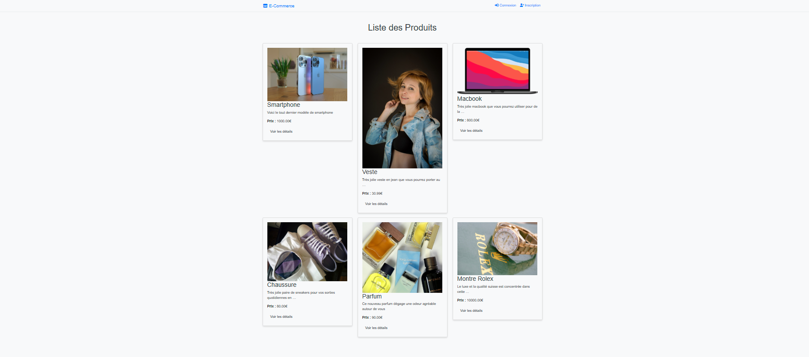
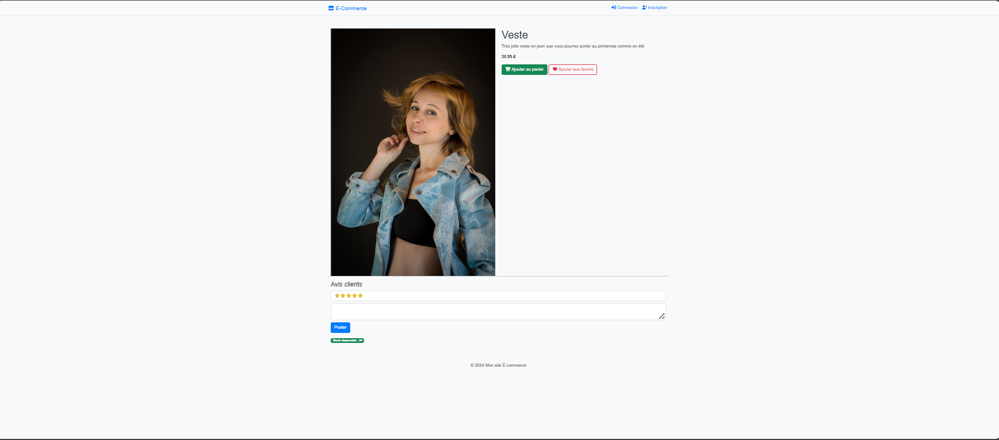
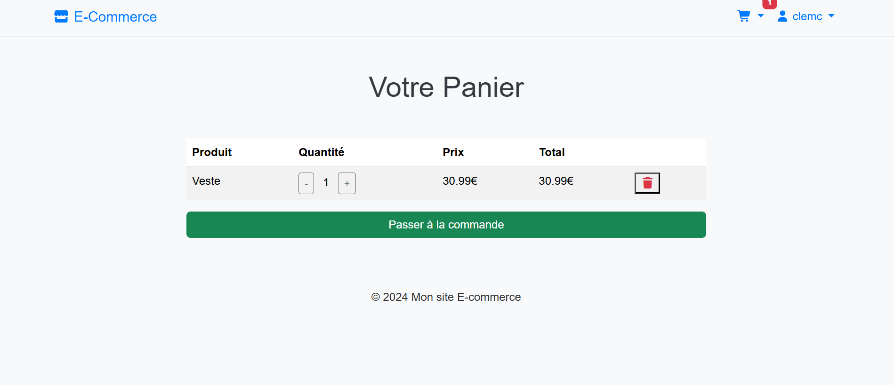
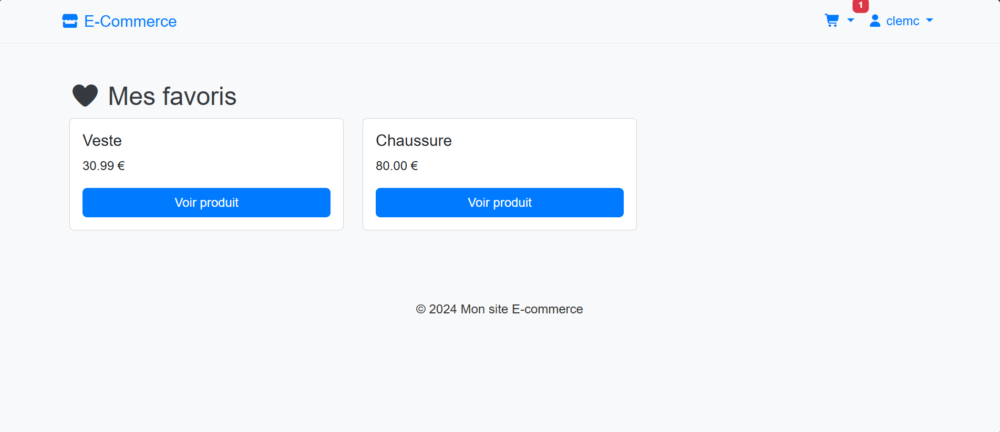
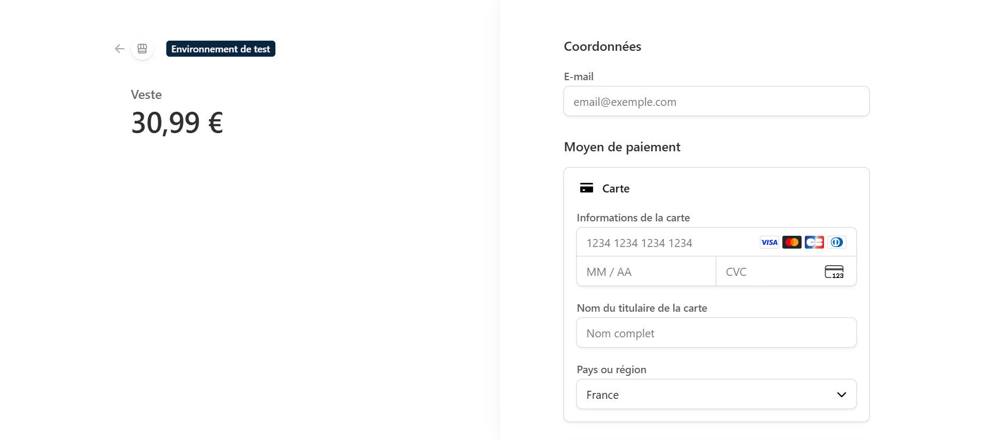
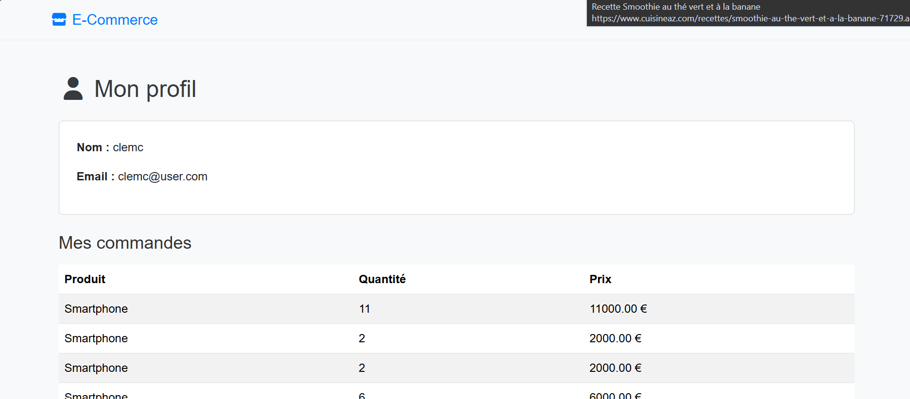
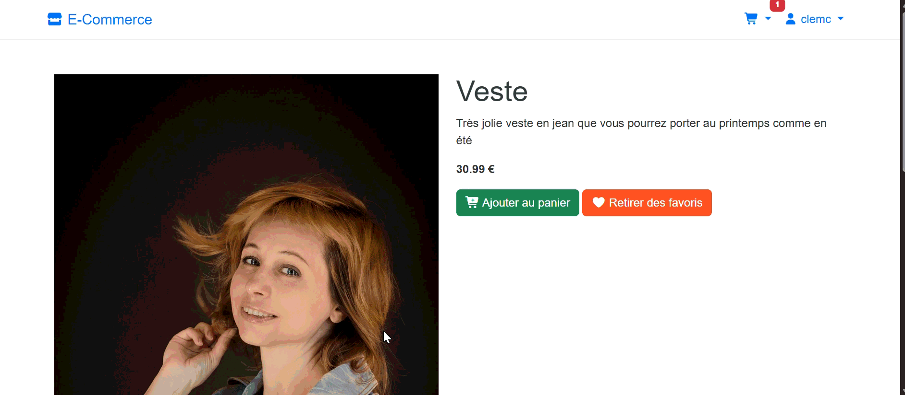

# 🛒 E-Commerce Django

Une application e-commerce complète développée avec **Django**, **Bootstrap 5**, **JavaScript (AJAX)** et **Stripe**.

L'objectif de ce projet est de proposer une boutique en ligne moderne avec gestion des utilisateurs, panier dynamique, liste de favoris, paiement sécurisé et interface responsive.

---

# ✨ Aperçu du projet

Cette application permet aux utilisateurs de :

- Créer un compte
- Se connecter et se déconnecter
- Parcourir les produits
- Consulter les détails d'un produit
- Ajouter des produits au panier
- Ajouter des produits aux favoris
- Gérer les quantités du panier
- Supprimer des produits du panier
- Effectuer un paiement sécurisé avec Stripe
- Consulter leur profil utilisateur
- Visualiser leurs favoris
- Recevoir des notifications visuelles (Toast)

---

# 🚀 Fonctionnalités

## 👤 Authentification

- Inscription
- Connexion
- Déconnexion sécurisée
- Profil utilisateur

---

## 🛍️ Catalogue produits

- Liste des produits
- Fiche produit détaillée
- Images produits
- Gestion du stock
- Affichage disponibilité

---

## 🛒 Panier dynamique

- Ajout au panier
- Suppression du panier
- Modification des quantités
- Mise à jour du compteur en temps réel
- Dropdown panier dans la navbar
- Total du panier calculé automatiquement

---

## ❤️ Wishlist

- Ajout aux favoris
- Suppression des favoris
- Page dédiée aux favoris
- Bouton dynamique

---

## 💳 Paiement Stripe

- Paiement sécurisé
- Stripe Checkout
- Redirection après paiement
- Gestion des commandes

---

## ⭐ Avis clients

- Notes produits
- Commentaires
- Historique des avis

---

## 🔍 Recherche & Filtres

- Recherche par nom
- Filtre par catégorie
- Filtre par prix

---

## 📱 Responsive Design

- Bootstrap 5
- Compatible mobile
- Compatible tablette
- Compatible desktop

---

# 🛠️ Technologies utilisées

## Backend

- Python 3
- Django
- SQLite (développement)
- Stripe API

## Frontend

- HTML5
- CSS3
- Bootstrap 5
- JavaScript
- AJAX (Fetch API)

## Bibliothèques

- Pillow
- Stripe
- Font Awesome

---

# 📸 Captures d'écran

## Accueil



---

## Détail produit



---

## Panier



---

## Favoris



---

## Paiement Stripe



---

## Profil utilisateur




## Gif de démonstration



---

# ⚙️ Installation

## 1. Cloner le projet

```bash
git clone https://github.com/votre-compte/ecommerce-django.git
cd ecommerce-django
```

## 2. Créer un environnement virtuel

```bash
python -m venv venv
```

### Windows

```bash
venv\Scripts\activate
```

### Linux / Mac

```bash
source venv/bin/activate
```

---

## 3. Installer les dépendances

```bash
pip install -r requirements.txt
```

---

## 4. Créer le fichier .env

Créer un fichier :

```env
SECRET_KEY=votre_secret_key

EMAIL_HOST_USER=votre_email@gmail.com
EMAIL_HOST_PASSWORD=votre_mot_de_passe_application

STRIPE_PUBLIC_KEY=pk_test_xxxxxxxxx
STRIPE_SECRET_KEY=sk_test_xxxxxxxxx
```

---

## 5. Effectuer les migrations

```bash
python manage.py makemigrations
python manage.py migrate
```

---

## 6. Créer un super utilisateur

```bash
python manage.py createsuperuser
```

---

## 7. Lancer le serveur

```bash
python manage.py runserver
```

---

Accéder au site :

```text
http://127.0.0.1:8000/
```

---

# 📂 Structure du projet

```text
ecommerce/
│
├── ecommerce/
│   ├── settings.py
│   ├── urls.py
│   └── wsgi.py
│
├── shop/
│   ├── migrations/
│   ├── static/
│   │   ├── css/
│   │   ├── js/
│   │   └── images/
│   │
│   ├── templates/
│   │   ├── registration/
│   │   │   ├── login.html
│   │   │   └── signup.html
│   │   │
│   │   └── shop/
│   │       ├── base.html
│   │       ├── product_list.html
│   │       ├── product_detail.html
│   │       ├── cart_detail.html
│   │       ├── wishlist.html
│   │       ├── payment.html
│   │       └── profile.html
│   │
│   ├── models.py
│   ├── views.py
│   ├── forms.py
│   ├── urls.py
│   └── context_processors.py
│
├── media/
│
├── .env
├── requirements.txt
├── manage.py
└── README.md
```

---

# 🔐 Sécurité

## Variables d'environnement

Les clés sensibles ne sont jamais stockées dans le dépôt Git.

Toutes les informations sensibles sont chargées via un fichier `.env`.

### Exemple

```env
SECRET_KEY=xxxxxxxxxxxx

EMAIL_HOST_USER=xxxxxxxx@gmail.com
EMAIL_HOST_PASSWORD=xxxxxxxx

STRIPE_PUBLIC_KEY=pk_test_xxxxxxxxx
STRIPE_SECRET_KEY=sk_test_xxxxxxxxx
```

---

## Ajouter `.env` dans `.gitignore`

```gitignore
.env
```

---

## Stripe

Les clés Stripe utilisées en développement sont des clés de test :

```env
STRIPE_PUBLIC_KEY=pk_test_xxxxx
STRIPE_SECRET_KEY=sk_test_xxxxx
```

Ne jamais publier les clés de production.

---

# 📈 Améliorations futures

- Historique des commandes
- Statuts des commandes
- Factures PDF
- Coupons de réduction
- Recherche AJAX
- Pagination
- Notifications temps réel
- Dashboard administrateur avancé
- Déploiement Docker

---

# 👨‍💻 Auteur

**Clément Cathala**

GitHub : https://github.com/clems-dev-maker

Projet réalisé dans le cadre de l'apprentissage du développement web avec Django.

---

# 📄 Licence

Projet distribué sous licence MIT.

Vous êtes libre de l'utiliser, le modifier et le partager.